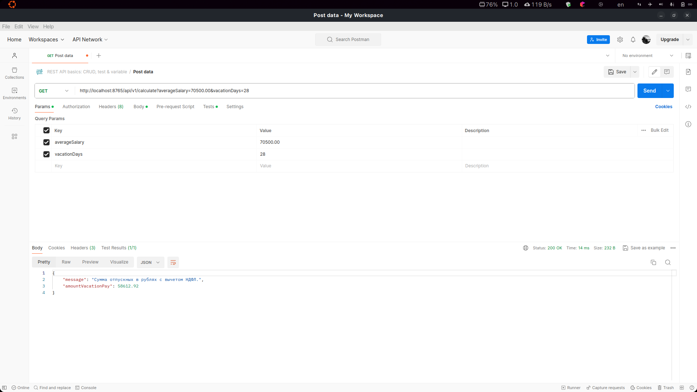

# Тестовое задание для учебного центра Neoflex, 2024.

Приложение "Калькулятор отпускных".
Микросервис на SpringBoot + Java 11 c одним API:
GET "/calculate"

Минимальные требования: Приложение принимает твою среднюю зарплату за 12 месяцев и количество дней отпуска - отвечает
суммой отпускных, которые придут сотруднику.
Доп.задание: При запросе также можно указать точные дни ухода в отпуск, тогда должен проводиться рассчет отпускных с
учётом праздников и выходных.

Проверяться будет чистота кода, структура проекта, название полей\классов, правильность использования паттернов.
Желательно написание юнит-тестов, проверяющих расчет.

# API requests

Простой запрос:  
http://localhost:8765/api/v1/calculate?averageSalary=70500.00&vacationDays=28  
Response: {"message":"Сумма отпускных в рублях с вычетом НДФЛ.","amountVacationPay":58612.92}

# Postman

Простой запрос:  

